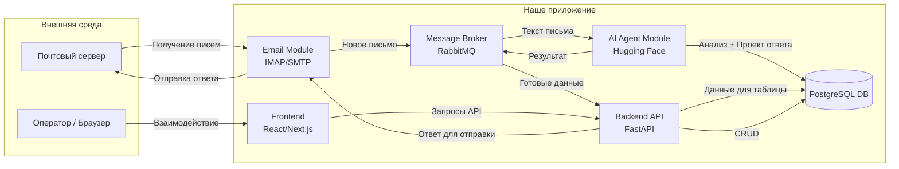

## 1. Информация о команде

- **Название команды:** IT-Спецназ
- **Состав команды и роли:**
  1. Канагатов Денис Алмасович – Team Lead.
  2. Азмагулов Ринат Маликович – ML Engineer / Backend Developer.
  3. Петрусенко Роман Васильевич – Frontend Developer / QA Engineer.
- **Контакты тимлида:**
    - ФИО: Канагатов Денис Алмасович
    - Telegram: @Kanagatov_Denis

---

## 2. Ссылка на репозиторий

- **Ссылка на GitHub:** [тык](https://github.com/KanagatovDenis/EnigmaHack)

---

## 3. Идея реализации

#### 3.1. Пользовательский путь

Мы представляем следующий сценарий работы оператора технической поддержки с системой:

1.  **Получение письма:** На почту техподдержки приходит новое обращение от клиента.
2.  **Автоматическая обработка:**
    - Система автоматически забирает письмо по IMAP.
    - Агент анализирует текст: определяет тему, категорию проблемы, извлекает суть запроса.
3.  **Поиск в базе знаний:** AI-агент ищет в базе данных наиболее релевантные предыдущие решения и статьи.
4.  **Заполнение веб-таблицы:**
    - Новая запись автоматически появляется в таблице на сайте для оператора.
    - В записи отображаются тема письма, отправитель, краткое содержание, предложенный агентом проект ответа и статус «Требует проверки».
5.  **Работа оператора:**
    - Оператор заходит на сайт, видит обновленную таблицу.
    - Оператор открывает запись, просматривает предложенный агентом ответ.
    - При необходимости текст ответа редактируется.
    - Нажимает кнопку «Подтвердить».
6.  **Отправка ответа:**
    - Сервис отправляет утвержденный ответ клиенту по SMTP.
    - Статус записи в таблице меняется на «Отвечено», фиксируются дата и время ответа.

#### 3.2. Архитектура системы

---

## 4. Анализ рисков

| Риск | Описание | План минимизации |
| :--- | :--- | :--- |
| **Сложность интеграции AI-моделей** | Тонкая настройка модели под специфику писем может занять много времени. | Использовать готовые, хорошо зарекомендовавшие себя модели. |
| **Качество генерации ответов** | AI может галлюцинировать. | Всегда оставлять финальное утверждение за оператором. |
| **Безопасность почтового аккаунта** | Хранение паролей от почтового ящика в коде или открытом виде. | Использовать переменные окружения для всех секретов. |
| **Отсутствие размеченных данных** | Для обучения модели классификации нужны размеченные примеры писем. | Начать с подхода по ключевым словам, параллельно собирать разметку от операторов. |
| **Интеграция с почтовым сервером** | Разные почтовые сервисы могут иметь особенности работы по IMAP/SMTP. | Использовать проверенные библиотеки. |
